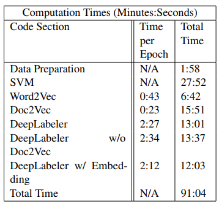
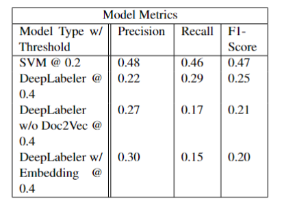

# DL4H-Automated-ICD-9-Coding

Author: Ryan Fogle

## Overview
The project is split up into 7 parts.

- Prepare-data
- SVM Training
- Word2Vec Training
- Doc2Vec Training
- DeepLabeler Training
- DeepLabeler minus Doc2Vec Training
- DeepLabeler with Embedding Layer

All of these trainings happen sequentially, please go through one by one. 

## Environment setup
This environment setup uses python 3.10, a 6 core CPU, and a Nvidia 3080 10GB. You'll need to install the dependencies as well.

```bash
cd DL4H-Automated-ICD-9-Coding
pip install -r requirements.txt
```

## Report 

The report can be seen in `report.pdf`

## Computation Times



## Model Metrics




## Summary of Paper

ICD-9 coding is a time-consuming task that requires a specialized skill set to provide accurate
ICD-9 codings. Using the discharge summaries and
ICD-9 diagnostic codes provided in the MIMIC-III
dataset, the paper ”Automated ICD-9 Coding via A
Deep Learning Approach” introduces a multi-label
classification problem. The authors of the paper
introduce a deep learning model called DeepLabeler which incorporates two models: a Word2Vec
model (Mikolov et al., 2013) and a Doc2Vec model
(Le and Mikolov, 2014). The paper claims DeepLabeler performs better (via an F1 score) than a traditional natural language processing model like a
support vector machine (Li et al., 2019).
## Summary of Findings

The results of this report do not support all of the claims made in the paper. The main premise of the paper is that by adding a deep learning architecture we can increase the micro-f1 score, my findings do not support that claim. Although, this report does support the claim that by adding the Doc2Vec
vectors, the micro-f1 score increases. 

## References

Gensim library: https://radimrehurek.com/gensim/

sci-kit learn: https://scikit-learn.org/stable/

pytorch library: https://pytorch.org/
